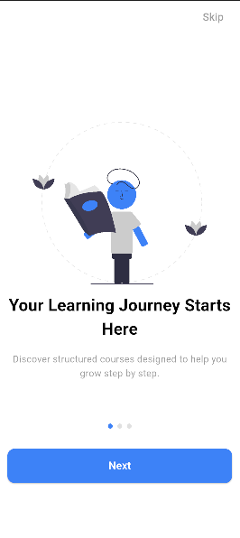
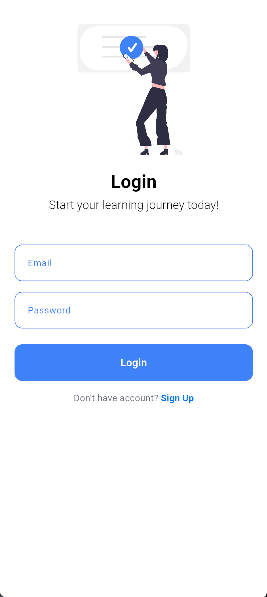
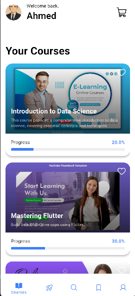
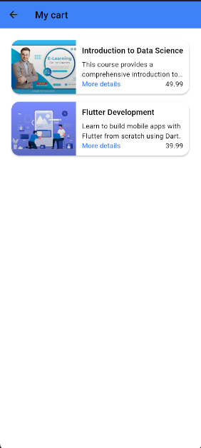
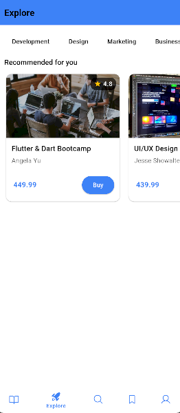
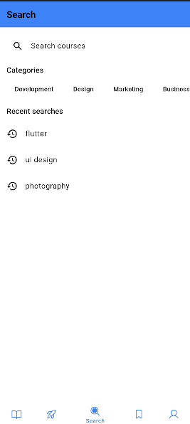
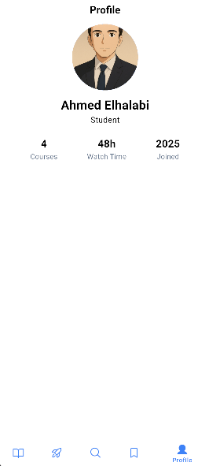

# LMS UI App 📚

A modern **Learning Management System (LMS)** mobile application UI built using **Flutter**.  
This project focuses on implementing scalable architecture, clean code practices, and reusable components.

---

## 🚀 Overview

This application is a UI implementation for an LMS platform where users can:

- Browse courses
- View course details
- Explore categories
- Manage learning progress
- Navigate through a clean and responsive educational interface

> Note: This project currently focuses on **UI implementation only**.

---

## 🏗 Architecture

This project follows **Clean Architecture** principles to maintain:

- Scalability
- Maintainability
- Separation of concerns
- Testability

Project layers:

```text
lib/
├── core/
├── features/
│   ├── data/
│   ├── domain/
│   └── presentation/
├── config/
└── main.dart
```

---

## ⚙ Dependency Injection

This project uses **GetIt** for Dependency Injection.

Example:

```dart
final sl = GetIt.instance;

void setupServiceLocator() {
  sl.registerLazySingleton<AuthRepository>(
    () => AuthRepositoryImpl(),
  );
}
```

---

## 🛠 Tech Stack

- Flutter
- Dart
- Clean Architecture
- GetIt
- Responsive UI
- Reusable Components
- Custom Widgets

---

## ✨ Features

- Authentication UI
- Home Screen UI
- Course Details UI
- Categories UI
- Search UI
- Profile UI
- Responsive Design
- Reusable Components

---

## 📸 Screenshots

<div align="center">

  
  
  
  
  
  
  
  

</div>

## 📦 Getting Started

Clone the repository:

```bash
git clone https://github.com/danielemad/Learnfy_App.git
```

Install dependencies:

```bash
flutter pub get
```

Run the project:

```bash
flutter run
```

---

## 🎯 Project Purpose

This project was built for practicing:

- Clean Architecture
- Dependency Injection
- Project structure organization
- Building scalable Flutter applications
- Writing reusable UI components

---

## 👨‍💻 Author

**Daniel Guirguis**  
Flutter Developer
